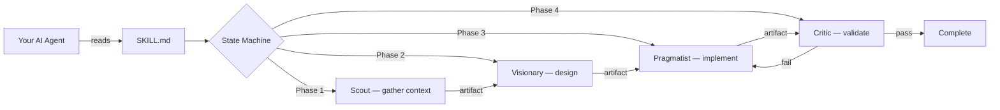

# Tech Skills

[](./LICENSE)
[](#available-skills)
[](./docs/PHILOSOPHY.md)

Structured, agent-agnostic skills that turn any AI coding assistant into an expert engineering team.

A **skill** is a reusable instruction set that guides an AI agent through complex tasks using defined phases, specialized personas, and quality gates. Each skill is a single Markdown file with YAML frontmatter — no vendor lock-in, no runtime dependencies. Install a skill, and your agent gains a structured workflow it can follow to produce reliable, auditable results.

## Why Tech Skills?

| Without Skills | With Tech Skills |
|---|---|
| AI generates code in a single pass with no structure | Agent follows defined engineering phases with quality gates between each step |
| Debugging is ad-hoc — "try this, try that" | Binary-search isolation with hypothesis testing and artifact-gated validation |
| Architecture decisions are based on pattern matching | First-principles deconstruction that challenges assumptions to their root constraints |
| UI feedback is subjective and inconsistent | Aesthetic audits scored against a formal design system rubric |
| Security reviews depend on what the model remembers | Red-team threat modeling with structured vulnerability classification |

## Quick Start

Paste this into your AI coding agent (Claude Code, Gemini CLI, Cursor, Windsurf, Cline, or any agent that reads Markdown):

```
Install skills from https://raw.githubusercontent.com/sarathsomana/tech-skills/main/INSTALL.md
```

The agent will read the instructions, detect your environment, and install the skills automatically. See the [full installation guide](#installation) for other options.

Once installed, try:

> "Use first-principles-design to architect my new API."

## Available Skills

### Foundation and Meta-Architecture

| Skill | Description | Use When |
|---|---|---|
| [Skill Architect](./skills/skill-architect/) | Designs, scaffolds, and validates new skills using the Phased State Machine architecture | You need to create a new skill from scratch |
| [Base State-Machine Runtime](./skills/base-state-machine-runtime/) | Standardized templates and runtime rules for phased state-machine skills | You are building on the framework and need the base contract |
| [First Principles Design](./skills/first-principles-design/) | Challenges assumptions through structured deconstruction until fundamental constraints are identified, then reconstructs the design from those truths | You are starting a new architecture or questioning an existing one |

### Core Engineering

| Skill | Description | Use When |
|---|---|---|
| [Implementation Engineer](./skills/implementation-engineer/) | Ingests architectural blueprints and executes phased coding, testing, and integration | You have a design and need to turn it into working code |
| [Root-Cause Isolator](./skills/root-cause-isolator/) | Binary-search style debugging with hypothesis testing and automated patch generation | You have a failing system and need to find the exact cause |
| [Legacy Modernizer](./skills/legacy-modernizer/) | Extracts logic from legacy code and refactors incrementally with functional equivalence guarantees | You need to modernize old code without breaking existing behavior |
| [Graphify v2](./skills/graphify-v2/) | Generates knowledge graphs from codebases for semantic understanding, dependency analysis, and architectural auditing | You need to understand a large or unfamiliar codebase |

### Visual and Experience

| Skill | Description | Use When |
|---|---|---|
| [UX Guardian](./skills/ux-guardian/) | Aesthetic audits, CSS refactoring, and animation polishing against design system standards | You want to audit or improve the visual quality of a UI |
| [Component Wizard](./skills/component-wizard/) | High-fidelity UI component generation from screenshots or design specifications | You need to build a component that matches a reference design |

### Hardening and Security

| Skill | Description | Use When |
|---|---|---|
| [Security Sentinel](./skills/security-sentinel/) | Red-team auditing, vulnerability patching, and threat modeling | You need to verify a system is secure before production |
| [Perf-Optimus](./skills/perf-optimus/) | Frontend and backend performance optimization with empirical before/after validation | You need to identify and fix performance bottlenecks |
| [Test Engineer](./skills/test-engineer/) | Test strategy design, test authoring, execution, and failure diagnosis | You need a comprehensive test plan or want to improve test coverage |

### Ecosystem and Integration

| Skill | Description | Use When |
|---|---|---|
| [Multi-Agent Orchestrator](./skills/multi-agent-orchestrator/) | Task decomposition and handover logic between different agents using shared skills | You need multiple agents to collaborate on a single task |
| [Skill Registry](./skills/skill-registry/) | Searchable index of community-contributed skills for discovery, validation, and installation | You want to find or publish skills |

## How It Works

Each skill follows the **Phased State Machine** architecture: a defined sequence of phases, each governed by a specialized persona, with transitions gated by concrete artifacts rather than open-ended reasoning.



Key principles:

- **Artifact-gated transitions.** A phase produces a tangible output (Markdown, JSON, code, or test results). The next phase uses that artifact as its source of truth. No hand-waving.
- **Composite personas.** Each phase activates a different cognitive temperament — a Scout gathers context, a Pragmatist builds, a Critic audits. This prevents a single mode of thinking from dominating the workflow.
- **Deterministic execution.** State transitions are gated on physical assertions (exit codes, file existence, test results), not on the model's self-assessment.
- **Agent-agnostic format.** Skills are plain Markdown with YAML frontmatter. They work with any agent that can read a file.

For the full design rationale, see [Philosophy: Phased State Machines](./docs/PHILOSOPHY.md).

## Installation

### Option A: Install via Your AI Agent (Recommended)

Paste this into your coding agent:

```
Install skills from https://raw.githubusercontent.com/sarathsomana/tech-skills/main/INSTALL.md
```

The agent reads [INSTALL.md](./INSTALL.md), detects your environment, and creates symlinks to the correct discovery path. Supports both global and project-level installation.

### Option B: Install via Shell Script

```bash
# Default: installs to ~/.agents/skills/
curl -sL https://raw.githubusercontent.com/sarathsomana/tech-skills/main/install.sh | bash

# Agent-specific: installs to the correct path for your agent
curl -sL .../install.sh | bash -s -- --agent claude
curl -sL .../install.sh | bash -s -- --agent gemini --scope project
```

Supported agents: `claude`, `gemini`, `antigravity`, `cursor`, `windsurf`, `cline`, `copilot`, `generic`. Run `install.sh --help` for all options.

### Option C: Manual Installation

```bash
git clone https://github.com/sarathsomana/tech-skills.git ~/.tech-skills
ln -s ~/.tech-skills/skills/* ~/.agents/skills/
```

### Local Development

If you have cloned the repository and want to install skills locally for testing:

```bash
./install-local.sh
```

This creates symlinks from `skills/` to `.agents/skills/` within the repository.

## Usage Examples

| Category | Example Prompt |
|---|---|
| Architecture | *"Use first-principles-design to evaluate whether we actually need a microservices architecture."* |
| Implementation | *"Use implementation-engineer to build the API layer from this design document."* |
| Debugging | *"Use root-cause-isolator to find why this integration test is failing intermittently."* |
| Modernization | *"Use legacy-modernizer to refactor this jQuery module to modern JavaScript."* |
| UX | *"Use ux-guardian to audit the visual quality of my dashboard page."* |
| Security | *"Use security-sentinel to red-team my authentication and session management."* |
| Performance | *"Use perf-optimus to profile and optimize this page's load time."* |
| Testing | *"Use test-engineer to design a test strategy for the payments module."* |

## Contributing

We welcome contributions — new skills, improvements to existing ones, and bug reports.

- **Add a new skill:** Fork the repo, create a directory under `skills/`, add a `SKILL.md` with YAML frontmatter, and submit a PR. See [CONTRIBUTING.md](./CONTRIBUTING.md) for details.
- **Improve a skill:** Submit a PR updating the relevant `SKILL.md` or associated files.
- **Report an issue:** Use the [bug report](./.github/ISSUE_TEMPLATE/bug_report.md) or [skill request](./.github/ISSUE_TEMPLATE/new_skill_request.md) templates.
- **Code of Conduct:** [CODE_OF_CONDUCT.md](./CODE_OF_CONDUCT.md)

## References

- [Philosophy: Phased State Machines](./docs/PHILOSOPHY.md) — The design principles behind constrained state execution
- [Development Roadmap](./docs/ROADMAP.md) — The 5-phase build plan for the skill library

## License

[MIT](./LICENSE)
